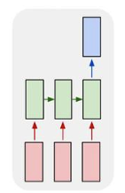

## Источник № 1

Идея рекуррентных нейронных сетей (RNN) заключается в последовательном использовании информации. В традиционных нейронных сетях подразумевается, что все входы и выходы независимы. Но для многих задач это не подходит. Если вы хотите предсказать следующее слово в предложении, лучше учитывать предшествующие ему слова. RNN называются рекуррентными, потому что они выполняют одну и ту же задачу для каждого элемента последовательности, причем выход зависит от предыдущих вычислений.

Такие модели используются в машинном переводе. Языковые модели, построенные с помощью RNN, позволяют генерировать новый текст. Обучение модели на поэмах Шекспира позволит генерировать новый текст, похожий на Шекспира.

Еще одна интерпретация RNN: это сети, у которых есть «память», которая учитывает предшествующую информацию. Теоретически RNN могут использовать информацию в произвольно длинных последовательностях, но на практике они ограничены лишь несколькими шагами.

В общем случае нейронную сеть можно развернуть. На схеме s_t можно воспринимать как "память" сети. Как видно, главное отличие от многослойного перцептрона заключается в том, что присутствует связь между нейронами скрытого слоя, то есть признаки не независимы друг от друга.

Вместе со сверточными нейронными сетями RNN использовались как часть модели генерации описаний неразмеченных изображений. Удивительно, насколько хорошо они работают. Комбинированная модель совмещает сгенерированные слова с признаками, найденными на изображениях.

Обучение RNN аналогично обучению обычной нейронной сети. Мы также используем алгоритм обратного распространения ошибки (backpropagation), но с небольшим изменением. Поскольку одни и те же параметры используются на всех временных этапах в сети, градиент на каждом выходе зависит не только от расчетов текущего шага, но и от предыдущих временных шагов. Например, чтобы вычислить градиент при t = 4, нам нужно было бы «распространить ошибку» на 3 шага и суммировать градиенты. Этот алгоритм называется «алгоритмом обратного распространения ошибки сквозь время» (Backpropagation Through Time, BPTT).

Рекуррентные нейронные сети, прошедшие обучение с BPTT, испытывают трудности с изучением долгосрочных зависимостей (например, зависимость между шагами, которые находятся далеко друг от друга) из-за затухания/взрывания градиента. Чтобы обойти эти проблемы, существует определенный механизм, были разработаны специальные архитектуры PNN (например LSTM).

Сети LSTM довольно популярны в наши дни, мы кратко говорили о них выше. LSTM не имеют принципиально отличающейся архитектуры от RNN, но они используют другую функцию для вычисления скрытого состояния. Память в LSTM называется ячейками, и вы можете рассматривать их как черные ящики, которые принимают в качестве входных данных предыдущее состояние h_ {t-1} и текущий входной параметр x_t. Внутри, эти ячейки, решают, какую память сохранить и какую стереть. Затем они объединяют предыдущее состояние, текущую память и входной параметр. Оказывается, эти типы единиц очень эффективны в захвате (хранении) долгосрочных зависимостей.

## Источник № 2

### Виды RNN

**Один к одному:** Архитектура по сути является обычной нейронной сетью.

**Один ко многим:** Один вход ко многим выходам может применяться, например, для генерации аудиозаписи. На вход подаем жанр музыки, который хотим получить, на выходе получаем последовательность аудиозаписи.

**Многие к одному:** Много входов и один выход может применяться, если мы хотим оценить тональность рецензии. На вход подаем слова рецензии, на выходе получаем оценку ее тональности: позитивная рецензия или негативная.

**Многие ко многим (пример 1):** Данную архитектуру можно использовать для перевода текста с одного языка на другой.

**Многие ко многим (пример 2):** Такой вариант подойдет для определения для классификации каждого слова в предложении в зависимости от контекста.

## Источник № 3

Просто для общего кругозора:

https://tproger.ru/translations/learning-neural-networks/

https://tproger.ru/translations/neural-network-zoo-1/

и действительно надо почитать:

https://tproger.ru/translations/neural-network-zoo-2/

## Источник № 4

Возможно имеет смысл посмотреть на досуге:

https://www.youtube.com/watch?v=MiXzBce-9zI

# Ссылки, откуда ворую:

[Источник № 1](https://neurohive.io/ru/osnovy-data-science/rekurrentnye-nejronnye-seti/)

[Источник № 2](http://neerc.ifmo.ru/wiki/index.php?title=%D0%A0%D0%B5%D0%BA%D1%83%D1%80%D1%80%D0%B5%D0%BD%D1%82%D0%BD%D1%8B%D0%B5_%D0%BD%D0%B5%D0%B9%D1%80%D0%BE%D0%BD%D0%BD%D1%8B%D0%B5_%D1%81%D0%B5%D1%82%D0%B8)

